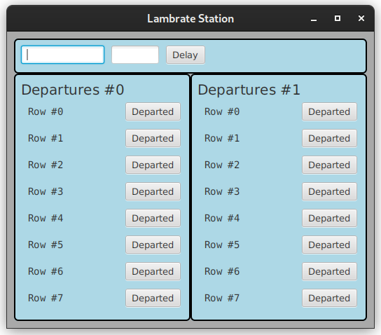

# CORSO INGEGNERIA DEL SOFTWARE A.A. 2022/23

# Esame del 26 gennaio 2023

* `<Cognome> <Nome> <matricola>`

Dopo avere effettuato il **fork** su `gitlab.di.unimi.it` e il **clone** in
locale, modificate questo README
inserendo i vostri dati seguendo lo schema sopra riportato.
Concedete quindi i permessi di lettura al vostro progetto su gitlab ai
docenti (`carlo.bellettini` e `mattia.monga`).

## Processo

Il progetto va implementato secondo la *metodologia TDD*, utilizzando `git flow`, quindi occorre iniziare con un `git flow init`.
Poi ripetere i passi seguenti fino ad aver implementato tutte le funzionalità richieste:

* creare un nuovo *branch* per la funzionalità corrente attraverso l'esecuzione del comando `git flow feature start`,
* implementare un test per le funzionalità volute;
* verificare che **il codice compili correttamente**, ma l'**esecuzione del test fallisca**;
  solo a questo punto effettuare un *commit* iniziando il messaggio di commit con la stringa `ROSSO:`,
* aggiungere la minima implementazione necessaria a realizzare la funzionalità, in modo che **il
  test esegua con successo**; solo a questo punto
  effettua un *commit* iniziando il messaggio di commit con la stringa `VERDE:`,
* procedere, se necessario, al **refactoring** del codice, accertandosi che le modifiche non
  comportino il fallimento di alcun test; solo in questo caso fa seguire a ogni
  passo un *commit* iniziando il messaggio di commit con la stringa `REFACTORING:`,
* eseguire il *merge* del *branch* per la funzionalità sviluppata all'interno del *branch develop*
  attraverso il comando `git flow feature finish`,
* **solo in fase di rilascio**, esegue una *release* all'interno del *branch master* attraverso il comando `git flow release start` e successivamente `git flow release finish`,
* effettua un *push* (di tutti i *branch*) con `git push origin --all --follow-tags`.

# STAZIONE DEI TRENI

Obiettivo dell'esercizio è progettare e realizzare un insieme di classi atte a produrre un semplice programma Java che
si occupi di gestire il tabellone delle partenze della stazione dei treni di Lambrate.

Vengono fornite due *Viste* del sistema:

- [`SetDelayView`](src/main/java/it/unimi/di/sweng/esame/view/SetDelayView.java):
  mette a disposizione due caselle di
  testo e un bottone per modificare il ritardo di un treno identificato dal suo
  codice.
- [`DepartureView`](src/main/java/it/unimi/di/sweng/esame/view/DepartureView.java):
  permette di presentare una lista di
  treni e tramite un bottone di indicarne la avvenuta partenza.

Viene fornita anche una prima versione della
classe [`Main`](src/main/java/it/unimi/di/sweng/esame/Main.java) che
permette d'istanziare la parte statica delle viste, di una
interfaccia [`InputPresenter`](src/main/java/it/unimi/di/sweng/esame/presenter/InputPresenter.java).

**TUTTE LE CLASSI DATE POSSONO ESSERE MODIFICATE (CANCELLATE, COMPLETATE) PER
ADERIRE A DIFFERENTI IDEE DI
PROGETTAZIONE**

Lanciando il programma (tramite il task `run` di gradle) si ottiene una interfaccia come quella nella figura
sottostante.

Allo stato attuale, la parte già implementata fa sì che alla partenza viene letto un file `trains.csv` contenente 
i dati dei prossimi 20 treni in partenza dalla stazione e stampati i dati letti.

## TRACCIA

Completare, in modo da realizzare un'organizzazione del sistema di tipo
*Model-View-Presenter*, le classi già presenti e aggiungere le
classi necessarie in modo che:

- nel riquadro a sinistra vengano presentati (in ordine di orario stimato di partenza effettiva, cioè orario programmato + ritardo previsto) 
i primi 8 treni in partenza, mentre nel riquadro a destra i successivi 8 (il numero 8 è fissato dalla costante `MAX_ITEMS` del `Main`);

- quando un treno è partito (segnalato dalla pressione del bottone `Departed`) sparisca dall'elenco e i 
treni scorrano nell'elenco in maniera opportuna.

Si noti che pur essendo ordinati secondo l'orario stimato di partenza, è possibile che parta anche un treno non in prima 
posizione (per questo i bottoni `Departed` sono presenti per tutti i treni).

Nel tabellone devono essere presentate nell'ordine per ogni treno mostrato le seguenti informazioni:
- codice treno
- destinazione finale
- orario programmato di partenza (non comprensivo del ritardo)
- ritardo stimato

Nella vista in alto è possibile dato un codice del treno inserire una nuova stima del ritardo del treno stesso.

### Suggerimenti

Oltre all'uso del pattern _Model-View-Presenter_, vi consigliamo di considerare
lo sfruttamento
al fine di scrivere un codice migliore anche di altri pattern (ad es. il pattern
_Strategy_, o il pattern _Template_) e in
ogni caso di prestare grande attenzione al rispetto dei principi **SOLID** di
buona progettazione Object Oriented.

Prestare estrema attenzione anche a garantire una corretta encapsulation dello
stato da parte delle arie classi (ad
esempio del Model) n modo da garantire l'assenza di escaping references di anche
solo parte dello stato.

### Testing

Mano a mano che si sviluppa il progetto, si deve controllare di mantenere una
copertura, sia dei comandi che delle
decisioni, soddisfacente (se inferiore al 100% inserire un commento che spieghi
perché non è possibile raggiungerlo).

Sono presenti anche diversi test di integrazione che il progetto "dovrebbe"
passare, mano a mano che il progetto viene implementato.
Vi dovrebbero essere di aiuto anche per capire cosa serve fare (cioè come
specifiche).
Se un test non contiene nessuna asserzione o verifica, vuol dire che si sta
verificando che termini
a causa di eccezioni non gestite.

### Consegna

Al termine del laboratorio dovete impacchettare l'ultima versione stabile come una _release_ di gitflow chiamata
"consegna" ed effettuare un ultimo *push* di tutti i rami locali (comprese eventuali feature aperte ma non completate):
`git push origin --all --follow-tags`

## **Verificate su `gitlab.di.unimi.it`** che ci sia la completa traccia dei *commit* effettuati e di averne dato visibilità ai docenti. 
