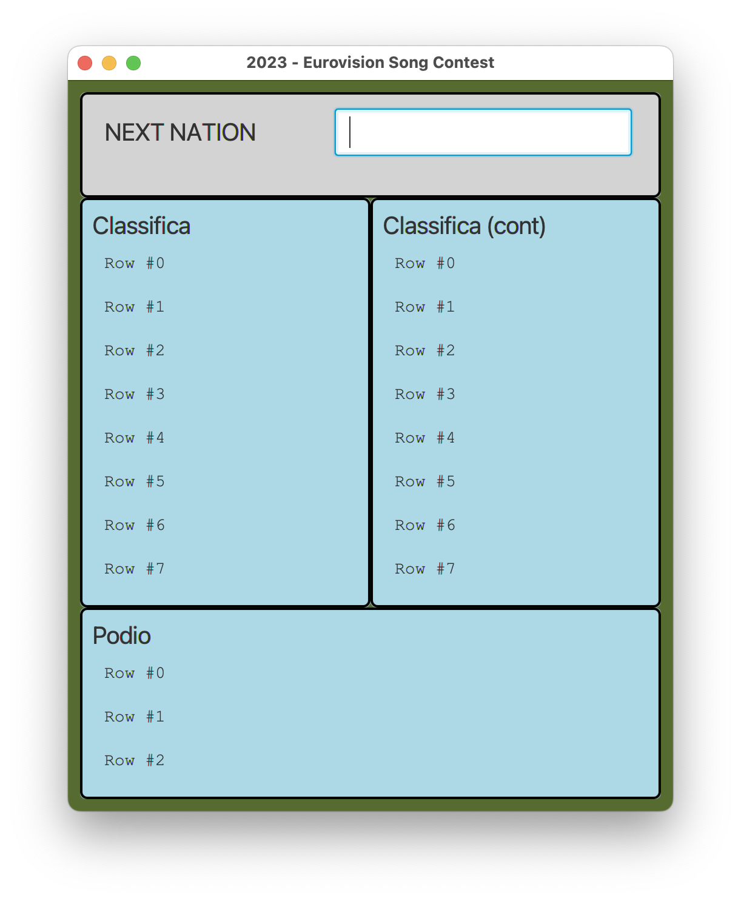
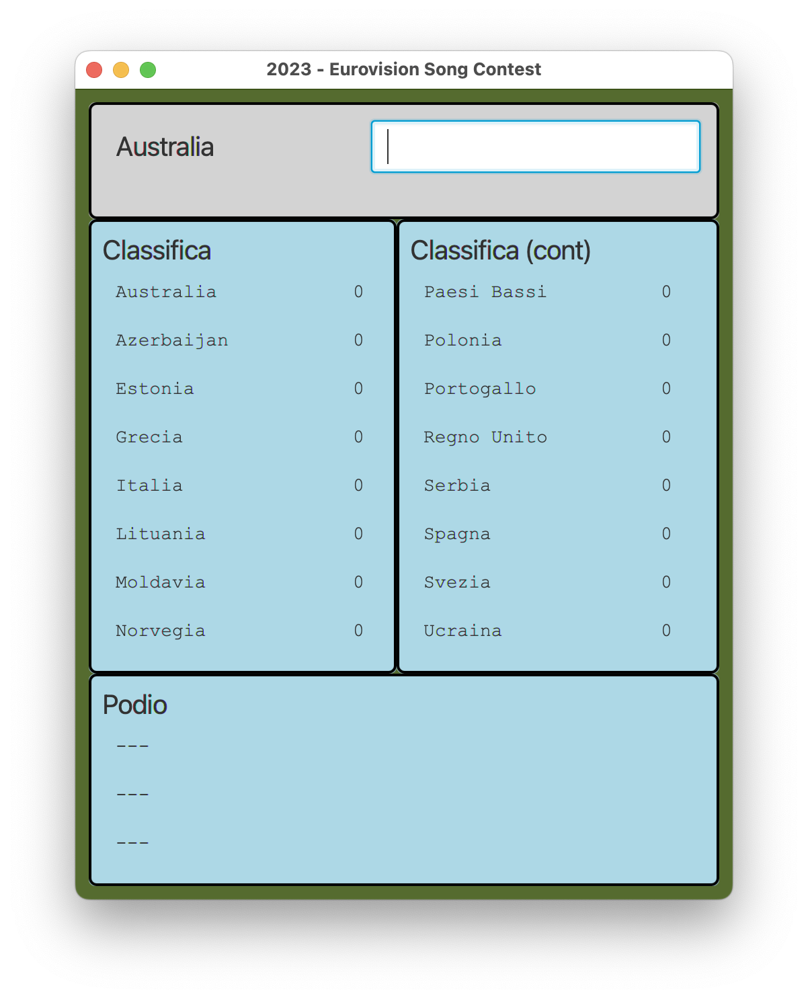
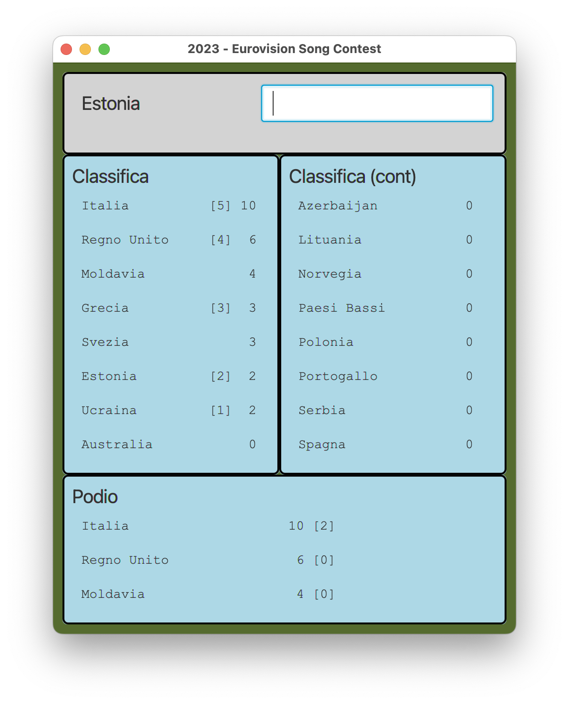

# CORSO INGEGNERIA DEL SOFTWARE A.A. 2022/23

# Esame del 16 febbraio 2023

* `<Cognome> <Nome> <matricola>`

Dopo avere effettuato il **fork** su `gitlab.di.unimi.it` e il **clone** in
locale, modificate questo README
inserendo i vostri dati seguendo lo schema sopra riportato.
Concedete quindi i permessi di lettura (livello **reporter**) al vostro progetto su gitlab ai
docenti (`carlo.bellettini` e `mattia.monga`).

## Processo

Il progetto va implementato secondo la *metodologia TDD*, utilizzando `git flow`, quindi occorre iniziare con un `git flow init`.
Poi ripetere i passi seguenti fino ad aver implementato tutte le funzionalità richieste:

* creare un nuovo *branch* per la funzionalità corrente attraverso l'esecuzione del comando `git flow feature start`,
* implementare un test per le funzionalità volute;
* verificare che **il codice compili correttamente**, ma l'**esecuzione del test fallisca**;
  solo a questo punto effettuare un *commit* iniziando il messaggio di commit con la stringa `ROSSO:`,
* aggiungere la minima implementazione necessaria a realizzare la funzionalità, in modo che **il
  test esegua con successo**; solo a questo punto
  effettua un *commit* iniziando il messaggio di commit con la stringa `VERDE:`,
* procedere, se necessario, al **refactoring** del codice, accertandosi che le modifiche non
  comportino il fallimento di alcun test; solo in questo caso fa seguire a ogni
  passo un *commit* iniziando il messaggio di commit con la stringa `REFACTORING:`,
* eseguire il *merge* del *branch* per la funzionalità sviluppata all'interno del *branch develop*
  attraverso il comando `git flow feature finish`,
* **solo in fase di rilascio**, esegue una *release* all'interno del *branch master* attraverso il comando `git flow release start` e successivamente `git flow release finish`,
* effettua un *push* (di tutti i *branch*) con `git push origin --all --follow-tags`.

# EUROVISION SONG CONTEST

Obiettivo dell'esercizio è progettare e realizzare un insieme di classi atte a
produrre un programma Java che si occupi di gestire la classifica durante le
comunicazioni dei voti delle giurie nazionali dell'Eurovision Song Contest.

Alla finale sono state ammesse 16 canzoni corrispondenti alle 16 nazioni elencate nella tabella seguente e presenti
nel file `FinalistNations`.

| COD | NAZIONE     |
|:---:|:------------|
| AU  | Australia   |
| AZ  | Azerbaigian |
| EE  | Estonia     |
| ES  | Spagna      |
| GR  | Grecia      |
| IT  | Italia      |
| LT  | Lituania    |
| MD  | Moldavia    |
| NL  | Paesi Bassi |
| NO  | Norvegia    |
| PL  | Polonia     |
| PT  | Portogallo  |
| RS  | Serbia      |
| SE  | Svezia      |
| UA  | Ucraina     |
| UK  | Regno Unito |

Solo queste 16 nazioni voteranno (procedendo in ordine alfabetico) elencando i codici delle 5 squadre
(separati da uno spazio) da loro preferite partendo dalla migliore.
Vengono assegnati 5 punti alla prima, 4 alla seconda, e via di seguito fino a 1 punto per la quinta.

Va controllato e opportunamente segnalato (tramite messaggio di errore settabile con metodo `showError` della classe
`NextNationView`) che le nazioni:
- non votino per sè stesse
- non votino codici non corretti
- votino esattamente 5 codici
- non votino più di una volta uno stesso codice

I messaggi previsti sono presenti nel test d'integrazione.

Vi vengono fornite già due classi *Viste* del sistema:

- `NextNationView`: la vista che permette d'indicare chi sta votando e d'immettere le cinque nazioni votate di volta in volta dalla nazione di turno;
- `DisplayView`: un display generale che permette di visualizzare alcune righe di
  testo e può essere usato per visualizzare le graduatoria, cioè un elenco di
  nazioni e loro punti.

Viene fornita anche una prima versione della classe `Main`, e una classe (`GUITest`) contenente dei test d'integrazione/validazione.

**TUTTE LE CLASSI DATE POSSONO ESSERE MODIFICATE (CANCELLATE, COMPLETATE) PER
ADERIRE A DIFFERENTI IDEE DI
PROGETTAZIONE**

Lanciando il codice attuale (tramite il task **run** di gradle) si ottiene inizialmente una
interfaccia come quella nella figura sottostante.

Dopo aver letto il file iniziale, le viste dovrebbero presentare la seguente situazione:

## TRACCIA

Completare, in modo da realizzare un'organizzazione del sistema di tipo
*Model-View-Presenter*, le classi già presenti e aggiungere le
classi necessarie in modo che ogni volta che una nazione vota il suo elenco di codici_nazione deve:
- aggiornare la vista in alto svuotando la casella di testo e presentando il nome della prossima
  nazione di cui immettere la classifica
- aggiornare la vista di sinistra con le migliori 8 canzoni e la vista di destra con le peggiori 8.
  In particolare questa classifica deve presentare oltre al nome della nazione, anche gli eventuali punti presi
  dall'ultimo inserimento e i punti ottenuti in totale fino a quel momento. In caso di parità punti
  vengono presentate in ordine alfabetico del nome (per il formato vedi figura sotto)
- La vista in basso presenterà solo le tre migliori canzoni indicando oltre al nome della nazione e ai suoi punti,
  quante volte sono state votate come migliore canzone (cioè hanno ottenuto i 5 punti), che in questa vista è il criterio con cui si
  disambigua l'ordinamento in caso di parità di punti (per il formato vedi figura sotto).

Dopo aver implementato correttamente il programma e letto il file iniziale, se ad esempio Australia avesse votato `IT MD SE UK UA` e l'Azerbaijan avesse votato `IT UK GR EE UA`, allora la situazione presentata dovrebbe essere:

Dopo l'inserimento degli ultimi voti, deve comparire la scritta nella vista in cima **END OF VOTES** e non accadere più nulla anche provando a inserire
altri voti.

### Suggerimenti

Oltre all'uso del pattern _Model-View-Presenter_, vi consigliamo di considerare
lo sfruttamento
al fine di scrivere un codice migliore anche di altri pattern (ad es. il pattern
_Strategy_, o il pattern _Template_) e in
ogni caso di prestare grande attenzione al rispetto dei principi **SOLID** di
buona progettazione Object Oriented.

Prestare estrema attenzione anche a garantire una corretta encapsulation dello
stato da parte delle arie classi (ad
esempio del Model) in modo da garantire l'assenza di **escaping references**  anche di
solo parte dello stato.

### Testing

Mano a mano che si sviluppa il progetto, si deve controllare di mantenere una
copertura, sia dei comandi che delle
decisioni, soddisfacente (se inferiore al 100% inserire un commento che spieghi
perché non è possibile raggiungerlo).

Sono presenti anche diversi test di integrazione che il progetto "dovrebbe"
passare, mano a mano che il progetto viene implementato.
Vi dovrebbero essere di aiuto anche per capire cosa serve fare (cioè come
specifiche).
Se un test non contiene nessuna asserzione o verifica, vuol dire che si sta
verificando che termini
a causa di eccezioni non gestite.

### Consegna

Al termine del laboratorio dovete impacchettare l'ultima versione stabile come una _release_ di gitflow chiamata
"consegna" ed effettuare un ultimo *push* di tutti i rami locali (comprese eventuali feature aperte ma non completate):
`git push origin --all --follow-tags`

## **Verificate su `gitlab.di.unimi.it`** che ci sia la completa traccia dei *commit* effettuati e di averne dato visibilità ai docenti.