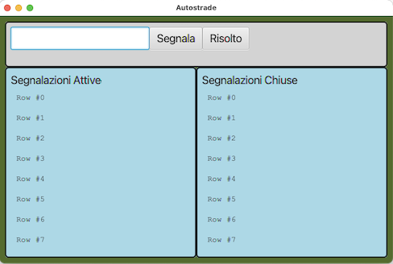

# CORSO INGEGNERIA DEL SOFTWARE A.A. 2022/23

# Esame del 22 giugno 2023

* `<Cognome> <Nome> <matricola>`

Dopo avere effettuato il **fork** su `gitlab.di.unimi.it` e il **clone** in
locale, modificate questo README
inserendo i vostri dati seguendo lo schema sopra riportato.
Concedete quindi i permessi di lettura (livello **reporter**) al vostro progetto su gitlab ai
docenti (`carlo.bellettini` e `mattia.monga`).

## Processo

Il progetto va implementato secondo la *metodologia TDD*, utilizzando `git flow`, quindi occorre iniziare con un `git flow init`.
Poi ripetere i passi seguenti fino ad aver implementato tutte le funzionalità richieste:

* creare un nuovo *branch* per la funzionalità corrente attraverso l'esecuzione del comando `git flow feature start`,
* implementare un test per le funzionalità volute;
* verificare che **il codice compili correttamente**, ma l'**esecuzione del test fallisca**;
  solo a questo punto effettuare un *commit* iniziando il messaggio di commit con la stringa `ROSSO:`,
* aggiungere la minima implementazione necessaria a realizzare la funzionalità, in modo che **il
  test esegua con successo**; solo a questo punto
  effettua un *commit* iniziando il messaggio di commit con la stringa `VERDE:`,
* procedere, se necessario, al **refactoring** del codice, accertandosi che le modifiche non
  comportino il fallimento di alcun test; solo in questo caso fa seguire a ogni
  passo un *commit* iniziando il messaggio di commit con la stringa `REFACTORING:`,
* eseguire il *merge* del *branch* per la funzionalità sviluppata all'interno del *branch develop*
  attraverso il comando `git flow feature finish`,
* **solo in fase di rilascio**, esegue una *release* all'interno del *branch master* attraverso il comando `git flow release start` e successivamente `git flow release finish`,
* effettua un *push* (di tutti i *branch*) con `git push origin --all` e poi `git push origin --tags`.

# VIAGGIARE INFORMATI

Obiettivo dell'esercizio è progettare e realizzare un insieme di classi atte a
produrre un programma Java che si occupi di gestire gli avvisi sulla situazione
del traffico nella rete autostradale.

Gli avvisi riguardano un tratto stradale (per semplicità identificato da una
sigla, p.es. A4), una
posizione espressa tramite il numero del Km e un descrizione di problema
("riduzione di carreggiata", "incidente", "traffico intenso").

La centrale operativa può aggiungere un nuovo avviso indicando le tre informazioni (tratto, km, descrizione)
separandole con una ',' o indicare che una
criticità segnalata in precedenza (dentificandola tramite tratto e km) risulta ora risolta.
- Non ci può essere più di un avviso riguardante lo stesso km di strada e quindi una "doppia" segnalazione deve essere rifiutata.
- Deve essere segnalato errore se si tenta di "risolvere" una segnalazione in un tratto in cui non ci sono segnalazioni
- Deve essere segnalato errore se il testo non rispetta il formato richiesto (numero insufficiente di campi, campi non validi, ecc.)
- Non ci possono essere più di 8 segnalazioni attive, quindi cercando di inserirne una nona deve essere rifiutata

Vi vengono fornite già due classi *Viste* del sistema:

- `CentralStationView`: la vista che permette d'immettere un nuovo avviso o segnalare la risoluzione di una criticità già segnalata;
- `DisplayView`: un display generale che permette di visualizzare alcune righe
  di testo e può essere usato per visualizzare le segnalazioni: a sinistra le (max 8) segnalazioni attive, a destra le (max 8) ULTIME
  segnalazioni risolte.

Viene fornita anche una prima versione della classe `Main`, e una classe (`GUITest`) contenente solo alcuni test d'integrazione/validazione.

**TUTTE LE CLASSI DATE POSSONO ESSERE MODIFICATE (CANCELLATE, COMPLETATE) PER
ADERIRE A DIFFERENTI IDEE DI
PROGETTAZIONE**

Lanciando il codice attuale (tramite il task **run** di gradle) si ottiene inizialmente una
interfaccia come quella nella figura sottostante.

## TRACCIA

Completare, in modo da realizzare un'organizzazione del sistema di tipo
*Model-View-Presenter*, le classi già presenti e aggiungere le
classi necessarie in modo che:
- ogni volta che viene inserita una nuova segnalazione (tratto, km, descrizione) corretta venga visualizzata la nuova segnalazione tra quelle attive (ordinando secondo il numero di tratta e a parità di tratta di numero di km)
- ogni volta che viene risolta una segnalazione (tratto, km) corretta venga tolta dalla vista di quelle attive e aggiunta alla vista di quelle risolte (ordinando secondo l'ordine di inserimento cioè con in cima le ultime inserite)
- ogni volta che viene dato un comando non valido venga presentato l'errore corrispondente.

Il formato con cui deve essere presentata una segnalazione è il seguente:
`<_descrizione_> sulla <_tratta_> al km <_km_>`

ad esempio, come si vede anche dai test, "incidente sulla A4 al km 12"

### Suggerimenti

Oltre all'uso del pattern _Model-View-Presenter_, vi consigliamo di considerare
lo sfruttamento
al fine di scrivere un codice migliore anche di altri pattern (ad es. il pattern
_Strategy_, o il pattern _Template_) e in
ogni caso di prestare grande attenzione al rispetto dei principi **SOLID** di
buona progettazione Object Oriented.

Prestare estrema attenzione anche a garantire una corretta encapsulation dello
stato da parte delle arie classi (ad
esempio del Model) in modo da garantire l'assenza di **escaping references**  anche di
solo parte dello stato.

### Testing

Mano a mano che si sviluppa il progetto, si deve controllare di mantenere una
copertura, sia dei comandi che delle
decisioni, soddisfacente (se inferiore al 100% inserire un commento che spieghi
perché non è possibile raggiungerlo).

Sono presenti anche alcuni test di integrazione.
Vi dovrebbero essere di aiuto anche per capire cosa serve fare (cioè come
specifiche).

Può essere utile oltre ai test di unità che scrivete durante il TDD prevedere di aggiungere anche qualche test di 
integrazione per verificare che il sistema funzioni correttamente anche facendo interagire le diverse classi reali.

### Consegna

Al termine del laboratorio dovete impacchettare l'ultima versione stabile (non ci possono essere test di unità che 
falliscono) a cui siete arrivati come una _release_ di gitflow chiamata
"consegna" ed effettuare un ultimo *push* anche di tutti i rami locali (comprese quindi eventuali feature aperte ma non 
completate e non presenti nella realease "consegna"):
`git push origin --all` e poi `git push origin --tags`

## **Verificate su `gitlab.di.unimi.it`** che ci sia la completa traccia dei *commit* effettuati e di averne dato visibilità ai docenti.
