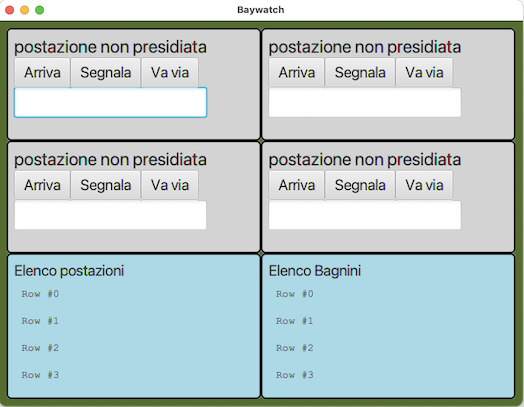
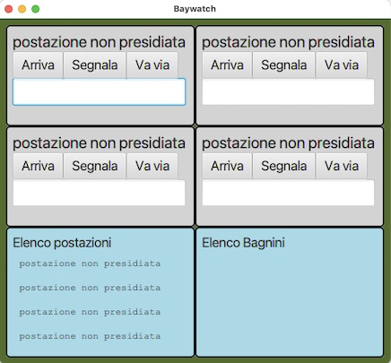
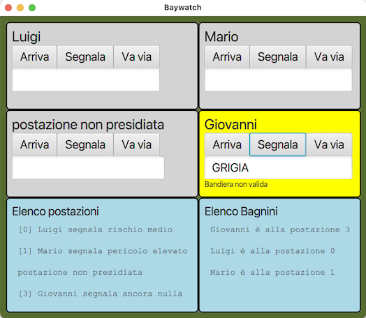

# CORSO INGEGNERIA DEL SOFTWARE A.A. 2022/23

# Esame del 6 luglio 2023

* `<Cognome> <Nome> <matricola>`

Dopo avere effettuato il **fork** su `gitlab.di.unimi.it` e il **clone** in
locale, modificate questo README
inserendo i vostri dati seguendo lo schema sopra riportato.
Concedete quindi i permessi di lettura (livello **reporter**) al vostro progetto su gitlab ai
docenti (`carlo.bellettini` e `mattia.monga`).

## Processo

Il progetto va implementato secondo la *metodologia TDD*, utilizzando `git flow`, quindi occorre iniziare con un `git flow init`.
Poi ripetere i passi seguenti fino ad aver implementato tutte le funzionalità richieste:

* creare un nuovo *branch* per la funzionalità corrente attraverso l'esecuzione del comando `git flow feature start`,
* implementare un test per le funzionalità volute;
* verificare che **il codice compili correttamente**, ma l'**esecuzione del test fallisca**;
  solo a questo punto effettuare un *commit* iniziando il messaggio di commit con la stringa `ROSSO:`,
* aggiungere la minima implementazione necessaria a realizzare la funzionalità, in modo che **il
  test esegua con successo**; solo a questo punto
  effettua un *commit* iniziando il messaggio di commit con la stringa `VERDE:`,
* procedere, se necessario, al **refactoring** del codice, accertandosi che le modifiche non
  comportino il fallimento di alcun test; solo in questo caso fa seguire a ogni
  passo un *commit* iniziando il messaggio di commit con la stringa `REFACTORING:`,
* eseguire il *merge* del *branch* per la funzionalità sviluppata all'interno del *branch develop*
  attraverso il comando `git flow feature finish`,
* **solo in fase di rilascio**, esegue una *release* all'interno del *branch master* attraverso il comando `git flow release start` e successivamente `git flow release finish`,
* effettua un *push* (di tutti i *branch*) con `git push origin --all` e poi `git push origin --tags`.

# SAPORE DI SALE

Obiettivo dell'esercizio è progettare e realizzare un insieme di classi atte a
produrre un programma Java che per la gestione di una spiaggia con zone
presidiate da bagnini.

Ogni bagnino segnala la propria presenza nella zona di competenza: ciò avviene
inviando un messaggio all'arrivo e all'abbandono della zona. Durante la
permanenza il bagnino può inviare messaggi che informano sullo stato della
balneabilità, indicando il colore convenzionale della bandiera corrispondente:
ROSSA (pericolo elevato), GIALLA (rischio medio, solo nuotatori esperti), VERDE
(nuoto sicuro), VIOLA (presenza di meduse).

- All'arrivo il bagnino indica il proprio nome cioè una stringa alfabetica:
  -  UNIVOCA (cioè non ci possono essere due bagnini attivi con lo stesso nome) 
  -  NON VUOTA
  -  di non più di 30 caratteri;
- La segnalazione di abbandono della postazione non prevede indicazioni nel campo di testo e chiaramente ha successo solo se la postazione era presidiata ;
- Le segnalazioni sullo stato di balneabilità 
  sono permesse solo dopo una segnalazione di arrivo e consistono nella indicazione del colore della bandiera esposta;
  - I colori della bandiera devono essere indicati esclusivamente con le stringhe
    dell'insieme ROSSA, GIALLA, VERDE, VIOLA.

Nell'esempio ci sono 4 zone di presidio con i bottoni per svolgere le operazioni sopra indicate
e 2 display.
Quello a sinistra indica lo
stato della 4 zone della nostra spiaggia, mentre quello a destra la postazione in cui si trovano i agnini attivi. 

In particolare nella vista display a sinistra per ogni zona/postazione verrà scritto a secondo del caso:
- **postazione non presidiata**
- **\[**  _numpostazione_ **\]** _nome bagnino_  **segnala**  _messaggio di stato dipendente dall'ultima bandiera segnalata_

ad esempio: [2] Carlo segnala presenza di meduse

Nella vista display a destra verrà invece scritto per ogni bagnino attivo (e in ordine alfabetico:
- _nome bagnino_  **è alla postazione**  _numero postazione_

## TRACCIA

Completare, in modo da realizzare un'organizzazione del sistema di tipo
*Model-View-Presenter*.

Vi vengono fornite già due classi *Viste* del sistema:

- `PostazioneView`: la vista che permette (vedi metodo `addHandlers`) di:
  - Comunicare arrivo di un bagnino in una zona;
  - Comunicare abbandono di un bagnino da una zona;
  - Comunicare il colore della bandiera scelto dal bagnino per una zona;
- `DisplayView`: un display generale che permette di visualizzare alcune righe
  di testo e può essere usato per visualizzare sia la situazione delle zone, che la posizione dei bagnini.

Viene fornita anche una prima versione della classe `Main`, e una classe (`GUITest`) contenente solo alcuni test d'integrazione/validazione.

**TUTTE LE CLASSI DATE POSSONO ESSERE MODIFICATE (CANCELLATE, COMPLETATE) PER
ADERIRE A DIFFERENTI IDEE DI
PROGETTAZIONE**

Lanciando il codice attuale (tramite il task **run** di gradle) si ottiene inizialmente una
interfaccia come quella nella figura sottostante.

Ad esempio partendo dalla seguente situazione iniziale

la sequenza di operazioni (con l'ultima che causerà errore):
- Arrivo alla postazione 1 del bagnino "Mario"
- che segnala la bandiera ROSSA;
- Arrivo alla postazione 0 del bagnino "Luigi"
- che segnala la bandiera GIALLA;
- Arrivo alla postazione 3 del bagnino "Giovanni"
- che segnala la bandiera GRIGIA;

porterebbe alla  situazione:

### Suggerimenti

Oltre all'uso del pattern _Model-View-Presenter_, vi consigliamo di considerare
lo sfruttamento
al fine di scrivere un codice migliore anche di altri pattern (ad es. il pattern
_Strategy_, o il pattern _Template_) e in
ogni caso di prestare grande attenzione al rispetto dei principi **SOLID** di
buona progettazione Object Oriented.

Prestare estrema attenzione anche a garantire una corretta encapsulation dello
stato da parte delle varie classi (ad
esempio del Model) in modo da garantire l'assenza di **escaping references**  anche di
solo parte dello stato.

### Testing

Mano a mano che si sviluppa il progetto, si deve controllare di mantenere una
copertura, sia dei comandi che delle
decisioni, soddisfacente (se inferiore al 100% inserire un commento che spieghi
perché non è possibile raggiungerlo).

Sono presenti anche alcuni test di integrazione.
Vi dovrebbero essere di aiuto anche per capire cosa serve fare (cioè come
specifiche).

Può essere utile oltre ai test di unità che scrivete durante il TDD prevedere di aggiungere anche qualche test di
integrazione per verificare che il sistema funzioni correttamente anche facendo interagire le diverse classi reali.

### Consegna

Al termine del laboratorio dovete impacchettare l'ultima versione stabile (non ci possono essere test di unità che
falliscono) a cui siete arrivati come una _release_ di gitflow chiamata
"consegna" ed effettuare un ultimo *push* anche di tutti i rami locali (comprese quindi eventuali feature aperte ma non
completate e non presenti nella realease "consegna"):
`git push origin --all` e poi `git push origin --tags`

## **Verificate su `gitlab.di.unimi.it`** che ci sia la completa traccia dei *commit* effettuati e di averne dato visibilità ai docenti.
