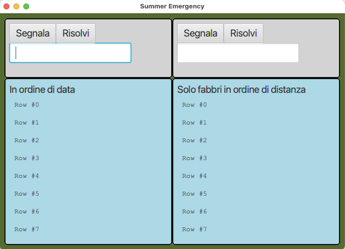
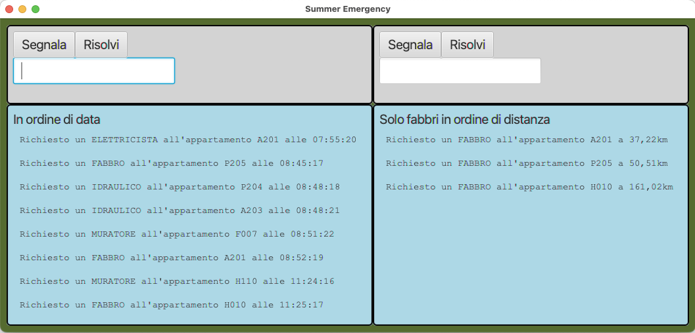

# CORSO INGEGNERIA DEL SOFTWARE A.A. 2022/23

# Esame del 24 luglio 2023

* `<Cognome> <Nome> <matricola>`

Dopo avere effettuato il **fork** su `gitlab.di.unimi.it` e il **clone** in
locale, modificate questo README
inserendo i vostri dati seguendo lo schema sopra riportato.
Concedete quindi i permessi di lettura (livello **reporter**) al vostro progetto su gitlab ai
docenti (`carlo.bellettini` e `mattia.monga`).

## Processo

Il progetto va implementato secondo la *metodologia TDD*, utilizzando `git flow`, quindi occorre iniziare con un `git flow init`.
Poi ripetere i passi seguenti fino ad aver implementato tutte le funzionalità richieste:

* creare un nuovo *branch* per la funzionalità corrente attraverso l'esecuzione del comando `git flow feature start`,
* implementare un test per le funzionalità volute;
* verificare che **il codice compili correttamente**, ma l'**esecuzione del test fallisca**;
  solo a questo punto effettuare un *commit* iniziando il messaggio di commit con la stringa `ROSSO:`,
* aggiungere la minima implementazione necessaria a realizzare la funzionalità, in modo che **il
  test esegua con successo**; solo a questo punto
  effettua un *commit* iniziando il messaggio di commit con la stringa `VERDE:`,
* procedere, se necessario, al **refactoring** del codice, accertandosi che le modifiche non
  comportino il fallimento di alcun test; solo in questo caso fa seguire a ogni
  passo un *commit* iniziando il messaggio di commit con la stringa `REFACTORING:`,
* eseguire il *merge* del *branch* per la funzionalità sviluppata all'interno del *branch develop*
  attraverso il comando `git flow feature finish`,
* **solo in fase di rilascio**, esegue una *release* all'interno del *branch master* attraverso il comando `git flow release start` e successivamente `git flow release finish`,
* effettua un *push* (di tutti i *branch*) con `git push origin --all` e poi `git push origin --tags`.

# EMERGENZE ESTIVE

Obiettivo dell'esercizio è progettare e realizzare un insieme di classi atte a
produrre un programma Java che si occupi di gestire segnalazioni di guasti
urgenti durante il periodo estivo.

Gli avvisi riguardano un insieme di stabili sotto la responsabilità di un unico
amministratore. Una segnalazione indica la mappatura catastale dell'appartamento
oggetto dell'urgenza (un codice alfanumerico composto da una lettera maiuscola 
seguita da 3 cifre numeriche), le coordinate
geografiche (p.es. 45.47599711, 9.232) e una descrizione della
tipologia d'intervento necessario (IDRAULICO, FABBRO, FALEGNAME,
ELETTRICISTA).

L'amministratore ha alcune viste che gli permettono di 

- inserire nuove segnalazioni usando il seguente formato:  
*codiceAppartamento* **;** *tecnicoRichiesto* **;** *lat* **;** *lon*  
(l'ora e minuti vengono inseriti automaticamente dal sistema).

- segnalare la risoluzione di una segnalazione già inserita, usando il seguente formato:  
*codiceAppartamento* **;** *tecnicoRichiesto*

- vedere le (al max 8) segnalazioni attive più vecchie (ordinate dalla più vecchia alla più recente)

- vedere le (al max 8) segnalazioni attive più vicine come km alla base del'amministratore (che ha lat=45.5 e lon=9.2) e che richiedono un FABBRO (ordinate per distanza crescente)

La distanza tra due coordinate può essere stimata usando la cosiddetta [Haversine
formula](https://en.wikipedia.org/wiki/Haversine_formula), di cui una possibile
implementazione (che può essere adattata liberamente per conformarsi meglio alle
vostre scelte progettuali e alla progettazione OO) è la seguente:

```java
// Return the approximate distance between two points on Earth
// (given as decimal degrees of latitude and longitude), in km
double haversine(double lat1, double lon1, double lat2, double lon2) {
        lat1 = Math.toRadians(lat1);
        lat2 = Math.toRadians(lat2);
        double dLat = lat2 - lat1;
        double dLon = Math.toRadians(lon2 - lon1);

        double a = Math.pow(Math.sin(dLat / 2), 2) + Math.pow(Math.sin(dLon / 2), 2) * Math.cos(lat1) * Math.cos(lat2);
        double c = 2 * Math.asin(Math.sqrt(a));
        return 6371 * c; // mean Earth radius in km
}
```


Tra i controlli da effettuare ci sono:

- Non ci può essere più di una segnalazione della stessa tipologia d'intervento per un determinato appartamento;
- Deve essere segnalato errore se il testo non rispetta il formato richiesto (numero insufficiente di campi, campi non validi, ecc.)

Vi vengono fornite già due classi *Viste* del sistema:


- `SummerReportView`: la vista che permette d'immettere una nuova segnalazione o indicarne la risoluzione di una già segnalata;
- `DisplayView`: un display generale che permette di visualizzare alcune righe
  di testo e può essere usato per visualizzare le segnalazioni: a sinistra le (max 8) segnalazioni attive ordinate per data, a destra le (max 8) richieste di FABBRO ordinate pr vicinanza.

e alcune interfacce: InputView, OutputView, Presenter.

Viene fornita anche una prima versione della classe `Main`, e una classe (`GUITest`) contenente  alcuni possibili test d'integrazione/validazione.

Della classe `Modello` viene data la prima parte di una funzione `readFile` che il Main richiama per leggere un CSV file con alcune segnalazioni da inserire inizialmente nel sistema.

Completare, in modo da realizzare un'organizzazione del sistema di tipo
*Model-View-Presenter*, le classi già presenti e aggiungere le
classi e le interfacce utili a raggiungere le richieste indicate.

Il formato con cui devono essere presentate le segnalazioni nelle due viste `DisplayView` e i messaggi di errore sono ricavabili sia dalle figure 
che dai test di integrazione.


**TUTTE LE CLASSI DATE POSSONO ESSERE MODIFICATE (CANCELLATE, COMPLETATE) PER
ADERIRE A DIFFERENTI IDEE DI PROGETTAZIONE**

Lanciando il codice attuale (tramite il task **run** di gradle) si ottiene inizialmente una
interfaccia come quella nella figura sottostante.





Dopo avere implementato il programma la schermata iniziale dovrebbe essere diventata come quella nella figura sottostante.




### Suggerimenti

Oltre all'uso del pattern _Model-View-Presenter_, vi consigliamo di considerare
lo sfruttamento
al fine di scrivere un codice migliore anche di altri pattern (ad es. il pattern
_Strategy_, o il pattern _Template_) e in
ogni caso di prestare grande attenzione al rispetto dei principi **SOLID** di
buona progettazione Object Oriented.

Prestare estrema attenzione anche a garantire una corretta encapsulation dello
stato da parte delle arie classi (ad
esempio del Model) in modo da garantire l'assenza di **escaping references**  anche di
solo parte dello stato.

### Testing

Mano a mano che si sviluppa il progetto, si deve controllare di mantenere una
copertura, sia dei comandi che delle
decisioni, soddisfacente (se inferiore al 100% inserire un commento che spieghi
perché non è possibile raggiungerlo).

Sono presenti anche alcuni test di integrazione.
Vi dovrebbero essere di aiuto anche per capire cosa serve fare (cioè come
specifiche).

Può essere utile oltre ai test di unità che scrivete durante il TDD prevedere di aggiungere anche qualche test di 
integrazione per verificare che il sistema funzioni correttamente anche facendo interagire le diverse classi reali.

### Consegna

Al termine del laboratorio dovete impacchettare l'ultima versione stabile (non ci possono essere test di unità che 
falliscono) a cui siete arrivati come una _release_ di gitflow chiamata
"consegna" ed effettuare un ultimo *push* anche di tutti i rami locali (comprese quindi eventuali feature aperte ma non 
completate e non presenti nella realease "consegna"):
`git push origin --all` e poi `git push origin --tags`

## **Verificate su `gitlab.di.unimi.it`** che ci sia la completa traccia dei *commit* effettuati e di averne dato visibilità ai docenti.
