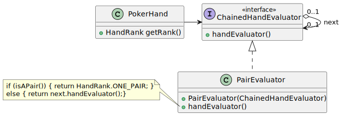

# CORSO INGEGNERIA DEL SOFTWARE A.A. 2022/23

## LABORATORIO 4

* TEAMMATE 1: <Cognome> <Nome> <matricola> 
* TEAMMATE 2: <Cognome> <Nome> <matricola>

Ogni coppia di studenti procede a effettuare il **fork** di questo repository.
L'utente che ha effettuato il fork modifica questo README inserendo le opportune **informazioni sui
membri del team** seguendo lo schema sopra riportato.
Inoltre, concede i permessi di scrittura al proprio compagno di team e i **permessi di lettura** ai
docenti (`carlo.bellettini` e `mattia.monga`).


## Giocare a carte

Il codice fornito è una versione (adattata secondo le convenzioni Gradle) del
programma Solitaire, scritto da Martin P. Robillard. Può essere eseguito
attivando il task `run` di Gradle.

In questo esercizio si richiede di utilizzare le classi del *package*
`ca.mcgill.cs.stg.solitaire.cards` senza modificarle, nello spirito
dell'"Open/Closed Principle". Le classi prodotte dovranno far parte del
*package* `it.unimi.di.sweng.lab04`.

### Obiettivi

- Si vuole avere una classe `PokerHand` che permetta di gestire un gruppo di
  carte (generalmente 5, parametro del costruttore) provenienti da un mazzo
  specifico (indicato in fase di costruzione degli oggetti `PokerHand`). Gli
  oggetti `PokerHand` forniscono un metodo `getRank()` per determinare il
  punteggio di una mano (in caso di dubbio, le regole sono riassunte qui:
  https://en.wikipedia.org/wiki/List_of_poker_hands). I possibili punteggi sono:

```java
  public enum HandRank {
   HIGH_CARD,
   ONE_PAIR,
   TWO_PAIR,
   THREE_OF_A_KIND,
   STRAIGHT,
   FLUSH,
   FULL_HOUSE,
   FOUR_OF_A_KIND,
   STRAIGHT_FLUSH
  }
```

- seguire una modalità di sviluppo guidata dai test (TDD) come spiegato negli altri laboratori

- Gli oggetti `PokerHand` espongono il gruppo di carte di cui sono composti solo
  tramite un *iteratore* (Utilizzare il *pattern Iterator*, sfruttando l'interfaccia `Iterable` della
  libreria standard)
  
- L'implementazione del metodo `getRank()` rischia di cadere nell'anti-*pattern*
  "Switch Statement". Per evitarlo, è
  possibile organizzare la valutazione del punteggio secondo un *pattern*
  "Chain-of-responsibility": si definisce un'interfaccia `ChainedHandEvaluator`
  che espone un metodo che, dato un oggetto `PokerHand` ne calcola il punteggio
  (`HandRank`) corrispondente; per ogni tipologia di punteggio che si vuole
  valutare, occorrerà implementare un sotto-tipo appropriato di
  `ChainedHandEvaluator`. Ciascun sotto-tipo di `ChainedHandEvaluator` conosce
  anche il "prossimo" valutatore (comunicato col proprio costruttore): ciò
  permette di costruire una catena di valutatori. Si può perciò iniziare dal
  valutatore del punteggio più alto (`STRAIGHT_FLUSH`) che avrà come prossimo
  valutatore quello di `FOUR_OF_A_KIND`, ecc. La logica di valutazione sarà: se
  il valutatore riconosce lo schema del "proprio" punteggio, restituisce il
  valore opportuno (p.es. se il valutatore del tris trova 3 carte dello stesso
  valore nella `PokerHand` restituisce `THREE_OF_A_KIND`, altrimenti richiama il
  prossimo valutatore, probabilmente il valutatore di doppie coppie). Non è
  _necessario_ realizzare tutti i valutatori ma almeno tre a vostra scelta.
  


- Gli oggetti `PokerHand` devono implementare l'interfaccia `Comparable`,
  ordinando le `PokerHand` secondo il valore restituito da `getRank()`. Non c'è
  bisogno di definire l'ordinamento fra mani con lo stesso punteggio.

- Definire un costruttore di `PokerHand` a partire da una stringa tipo 
  `"7H JC JH 1C 4C"` -> (SEVEN of HEARTS, JACK of CLUBS, JACK of HEARTS, ACE of CLUBS,
  FOUR of CLUBS). Si suggerisce di usare la classe `Scanner` (che implementa il
  pattern Iterator) e di definire due metodi `Rank parseRank(String)` e 
  `Suit parseSuit(String)`
  
- Definire una classe `PokerTable` con la responsabilità di gestire un numero
  variabile di giocatori, ognuno dei quali riceve una `PokerHand` dal medesimo
  `Deck`;

- La classe `PokerTable` deve fornire un metodo `PokerHand getHand(int i)` che 
  restituisce una copia della mano del giocatore i-esimo;
  
- Aggiungere un costruttore a `PokerHand` che parte da una lista di carte e ne fa una copia interna;

- Aggiungere a `PokerTable` un metodo `PokerHand change(int player, List<Card> toChange)` 
  che permetta di cambiare le carte della mano del giocare numero
  `player`, con il vincolo che almeno una deve restare invariata; si
  definiscano opportunamente:

        - l'asserzione della precondizione che le carte da cambiare devono far parte della mano 
          del giocatore e che almeno una carta non venga cambiata
        
        - l'asserzione della postcondizione che il risultato non contiene 
          le carte che si volevano cambiare

- La classe `PokerTable` deve fornire un metodo che restituisce un iteratore su
  `Integer` che permetta di scorrere gli identificatori dei `player`
  ordinati dal punteggio più alto al più basso
  
- Se rimane tempo completare i valutatori lasciati in sospeso e estendere
  il confronto di `PokerHand` in modo che risolva anche i casi di parità di
  ranking (vedi https://en.wikipedia.org/wiki/List_of_poker_hands)
